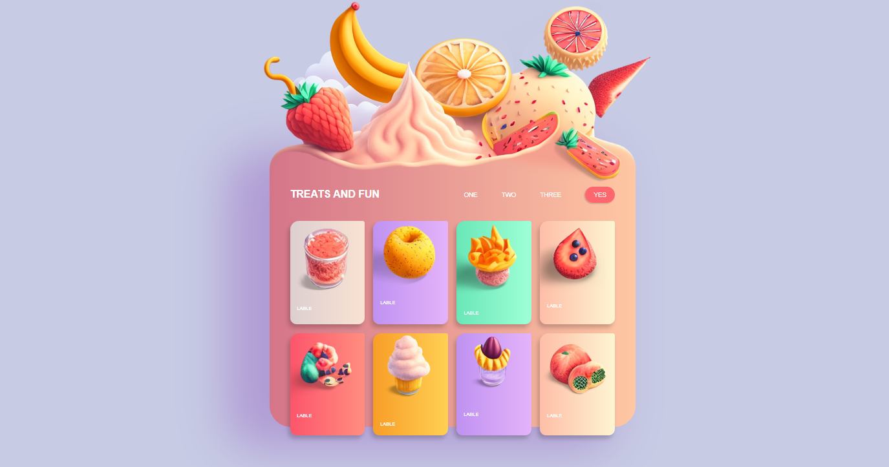

<div align="center">

# 🍎 Fruit Shop Website
### Simple & Responsive HTML Fruit Store

<!-- Preview Image -->


<br/><br/>


</div>

---

## 📌 About The Project

This project is a **simple and modern fruit shop website** built using **pure HTML, CSS, and JavaScript**.  
It simulates an **online fruit store** where users can browse fresh fruits with a clean and user-friendly interface.

---

## ✨ Features

- 🛒 Product listing (fruits)
- 📱 Fully responsive design
- 🎨 Modern and clean UI
- 🧺 Simple shop layout
- ⚡ Fast loading
- 🚫 No frameworks used

---

## 🛠 Tech Stack

| Technology | Usage |
|----------|------|
| HTML5 | Page structure |
| CSS3 | Styling & layout |
| JavaScript | Interactions (optional) |

---

## 📂 Project Structure

```bash
fruicy-main
├─ css
│  └─ style.css
├─ img
│  ├─ desert.png
│  ├─ dessert.png
│  ├─ grapefruit.png
│  ├─ header.png
│  ├─ icecream.png
│  ├─ mysteryfruit.png
│  ├─ preview.png
│  ├─ smoothie.png
│  ├─ strawberry.png
│  ├─ unknown.png
│  └─ unknown2.png
├─ index.html
├─ LICENSE
└─ README.md

```